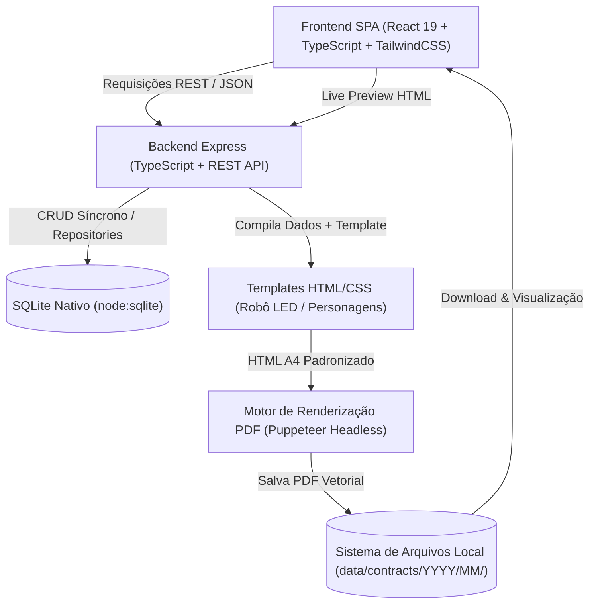

# Arquitetura do Sistema de Contratos — Robo Led Partner

## 1. Visão Geral da Arquitetura

O sistema foi concebido sob o paradigma **Local-First & Desktop-Ready**, focado em alta disponibilidade, privacidade de dados cadastrais e autonomia operacional.

---

## 2. Componentes Principais

### 2.1 Camada Frontend (`src/client/`)
- **Framework**: React 19 com TypeScript.
- **Estilização**: TailwindCSS 3 com paleta de cores personalizada da marca (*magenta/neon* `#d9008f`, `#9b00e8` e tema dark `#0b0d13`).
- **Navegação & UI**:
  - `DashboardPage`: Métricas operacionais, faturamento total, calendário de próximos eventos e atalhos rápidos.
  - `NovoContratoPage`: Wizard passo a passo interativo com validação de CPF em tempo real, cálculo de parcelas 40%/60%, cálculo automático do horário de término do evento e **Live Preview HTML do Contrato Oficial**.
  - `ContratosPage`: Histórico completo com busca em tempo real (por nome, CPF, número), filtros por atração/status, e ações rápidas (Visualizar, Baixar PDF, Gerar Novamente, Duplicar Contrato, Editar e Excluir).
  - `ConfiguracoesPage`: Gestão dinâmica dos dados da empresa contratada (Razão Social, Responsável, CNPJ, Endereço, Foro).
  - `ToastContext`: Sistema de notificações amigáveis ao usuário.

### 2.2 Camada de Domínio (`src/domain/`)
Regras puras de negócio, isoladas de frameworks:
- `cpf.ts`: Validação matemática estrita de CPF pelo algoritmo oficial dos dois dígitos verificadores ($D_1$ e $D_2$), rejeição de dígitos repetidos, limpeza e máscara de digitação.
- `calculations.ts`: Cálculo de entrada (40%) e restante (60%) em centavos inteiros com garantia de soma exata $V_{entrada} + V_{restante} = V_{total}$, cálculo de horário de término ($H_{inicio} + D_{horas}$) e formatadores BRL.
- `date.ts`: Manipulação segura de datas UTC/Local, formatação descritiva em português ("15 de setembro de 2026") e datas por extenso para assinaturas ("São Bernardo do Campo, 26 de agosto de 2026").
- `number-generator.ts`: Geração sequencial atômica de identificadores `RLP-YYYY-NNNNNN`.
- `sanitizer.ts`: Sanitização de nomes de arquivos para compatibilidade total com Windows, Linux e macOS.

### 2.3 Camada de Banco de Dados (`src/server/db/`)
- **Engine**: `node:sqlite` nativo do Node.js v24 (módulo síncrono ultra-rápido, sem dependência de compiladores nativos C++/Python).
- **Esquema Relacional**:
  - `configuracoes`: Dados cadastrais e institucionais da empresa.
  - `clientes`: Contratantes cadastrados (indexados por CPF único).
  - `eventos`: Detalhes operacionais de cada apresentação (data, horários, local, duração).
  - `contratos`: Vínculo entre cliente, evento, tipo de atração, valores, status e caminho do PDF.

### 2.4 Motor de Geração de Documentos (`src/pdf/` e `src/templates/`)
- **Puppeteer Headless**: Compila o HTML/CSS gerado pelos templates e produz arquivos PDF vetoriais em formato A4 perfeito (210mm x 297mm).
- **Sem Dependência de Rede Externa**: O logotipo da marca é embutido diretamente em formato Base64 nas páginas, garantindo que o PDF seja gerado instantaneamente mesmo sem acesso à internet.
- **Organização de Armazenamento**: Os PDFs gerados são salvos hierarquicamente por ano e mês (`data/contracts/YYYY/MM/RLP-YYYY-NNNNNN_Cliente_Atracao.pdf`).
