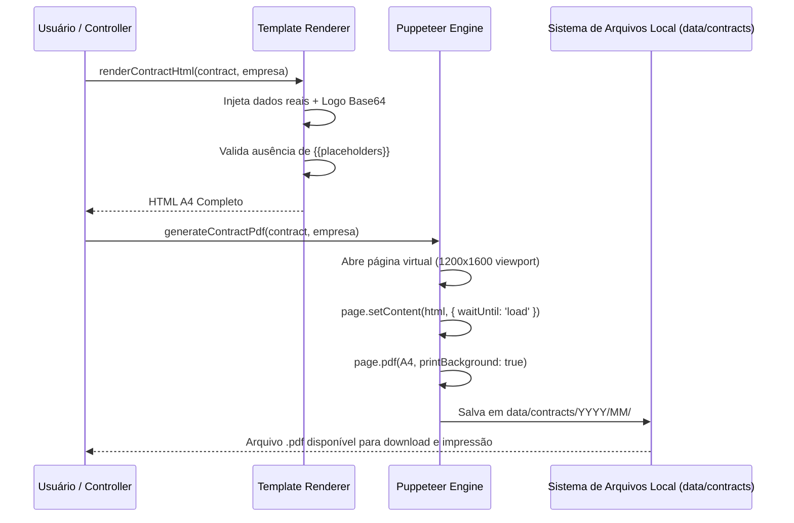

# Motor de Geração e Renderização de PDF — Robo Led Partner

Este documento descreve os detalhes técnicos da conversão dos contratos em arquivos PDF profissionais de alta definição com fidelidade visual absoluta.

---

## 1. Pipeline de Renderização



---

## 2. Padrões de Layout e Estilização A4

Para evitar cortes de página indesejados e garantir que o contrato tenha exatamente **2 páginas** com diagramação idêntica ao original:

1. **Dimensões Físicas Estritas**:
   ```css
   @page {
     size: A4 portrait;
     margin: 0;
   }
   .contract-page {
     width: 210mm;
     height: 297mm;
     box-sizing: border-box;
     padding: 0;
     page-break-after: always;
   }
   ```
2. **Impressão de Cores e Gradientes**:
   ```css
   * {
     -webkit-print-color-adjust: exact !important;
     print-color-adjust: exact !important;
   }
   ```
3. **Logotipo Local embutido em Base64**:
   O logotipo oficial da Robo Led Partner é lido localmente e inserido diretamente no HTML como `data:image/png;base64,...`. Isso evita requisições de rede, elimina falhas por CORS ou timeout, e viabiliza a geração de PDFs mesmo 100% offline.

---

## 3. Sanitização de Nomes de Arquivo para Windows

O sistema gera arquivos com nomes padronizados e seguros para qualquer sistema de arquivos:
$$\text{RLP-YYYY-NNNNNN\_Nome-do-Cliente\_TipoAtracao.pdf}$$

- Caracteres proibidos no Windows (`\ / : * ? " < > |`) são removidos automaticamente.
- Acentos são normalizados (`NFD` -> ASCII básico).
- Espaços consecutivos são convertidos em hífen (`-`).
- Exemplo: `RLP-2026-000001_Maria-da-Silva_RoboLED.pdf`.

---

## 4. Servindo PDFs pela API Local

O backend fornece dois métodos de entrega:
1. **Download / Inline Streaming (`GET /api/contratos/:id/pdf`)**:
   Envia o binário com cabeçalho `Content-Type: application/pdf` e `Content-Disposition: inline; filename="..."`.
2. **Visualização Direta HTML (`GET /api/contratos/:id/html`)**:
   Permite carregar o documento em iframes de alta fidelidade e acionar a impressão direta via browser (`window.print()`).
